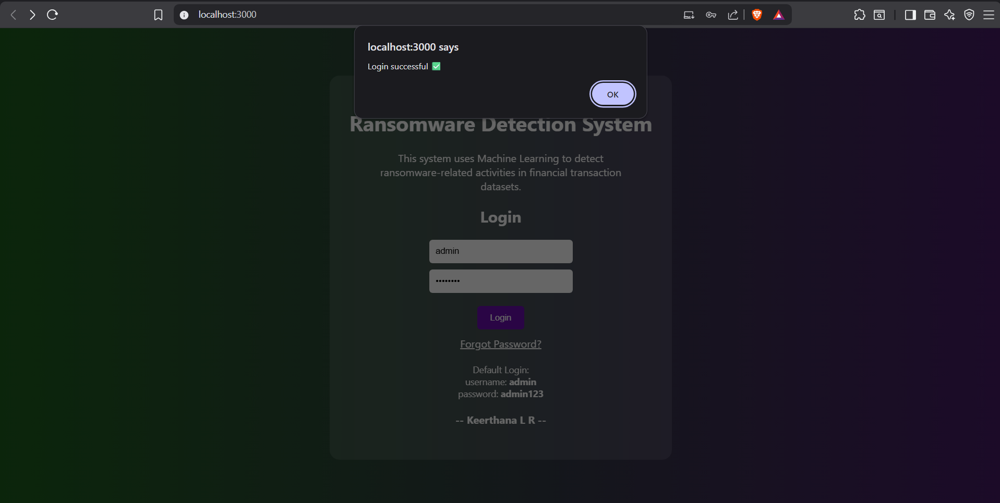
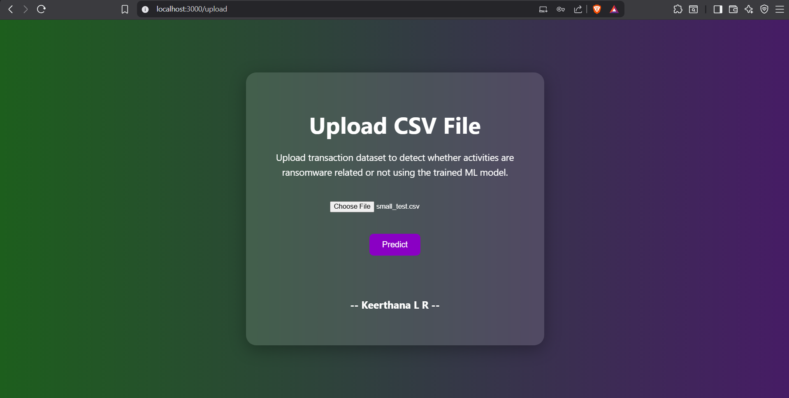
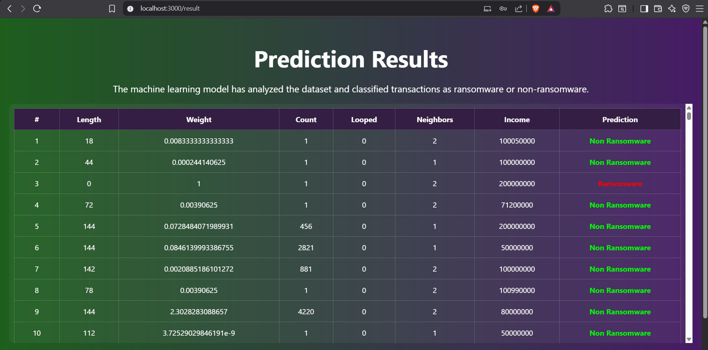

# 🚀 Ransomware Detection System

## 🔐 Overview
This project is a full-stack machine learning application that detects ransomware- React for frontend UIThis project is a full-stack machine learning application that detects ransomware activities in financial transaction datasets.

---

## 🧠 Features

✅ User Authentication (Login system)  
✅ CSV File Upload  
✅ Machine Learning Prediction  
✅ Result Visualization using Table  
✅ Multi-page UI (Login → Upload → Result)  

---

## 🛠️ Tech Stack

### Backend
- Python
- FastAPI
- Scikit-learn
- Pandas

### Frontend
- ReactJS
- Axios

---

## 📸 Screenshots

### 🔐 Login Page


### 📂 Upload Page


### Result


---

## ▶️ How to Run

### 🔧 Backend

```bash
cd backend
pip install -r requirements.txt
python -m uvicorn main:app --reload

The system uses:
- Machine Learning for detection
- FastAPI for backend
